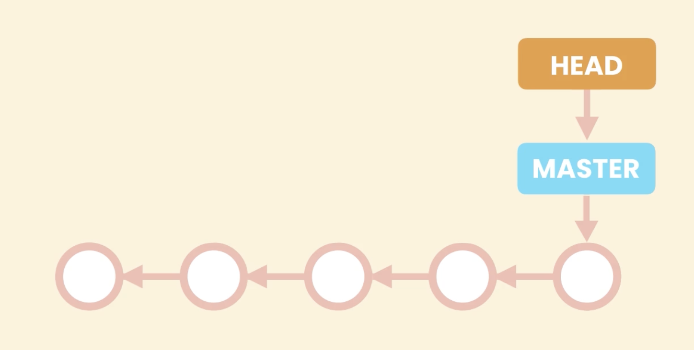
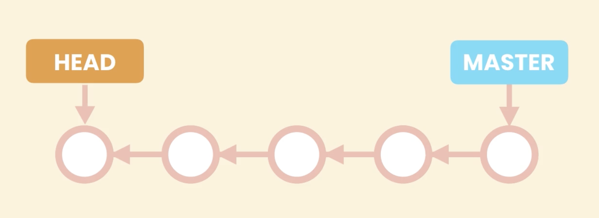

# Comprehensive Git Notes

## Basic

### Why Version Control System
- Track History
- Collaborate with others

### Types of Version Control System
- Centralized
- Distributed

### Setting
There are three setting levels in git:
1. **System**:
    - **Scope**: Applies to every user and all repositories on the machine.
    - **Location**: Stored in a system-wide configuration file (usually /etc/gitconfig on Linux/Mac, or in the Git installation directory on Windows).
    - **Usage**: Use this level to enforce policies or default behaviors for all users on a system.
    ```bash
    git config --system <key> <value>
    ```
2. **Global**:
    - **Scope**: Applies to the current user across all repositories on that machine.
    - **Location**: Stored in the user’s home directory, typically in ~/.gitconfig.
    - **Usage**: Ideal for user-specific configurations, such as name and email, which appear in commits.
    ```bash
    git config --global <key> <value>
    ```
3.  **Local**:
    - **Scope**: Specific to a single repository.
    - **Location**: Stored in the repository’s .git/config file.
    - **Usage**: Use local settings for repository-specific options like remote URLs, branch settings, or some custom behaviors that differ from your global preferences.
    ```bash
    git config --local <key> <value>
    ```

#### Common Settings
```bash
git config --global user.name "xyh" # Sets global commit author name.
git config --global user.email "abc@gmail.com" # Sets global commit author email.
git config --global core.editor "" # Defines global default text editor for Git.
git config --global core.autocrlf "" # windows - true, mac - input
# Configures Git’s automatic line ending conversion based on OS.
```
> Note: Global Core Autocrlf
> - On **Windows**: It’s common to set this to true so that Git converts **LF (Unix)** to **CRLF (Windows)** on checkout and vice versa on commit.
> - On **MacOS/Linux**: It’s typical to set this to input so that line endings **remain in Unix format** on commit while **converting CRLF to LF on input if necessary**.  


The file `config` can be open and updated:
```bash
git config --global -e # open global settings
```


#### Alias
```bash
# Set up custom command git lg 
git config --global alias.lg "log --pretty=format:'%an committed %h'"
```
```bash
# After set up
git lg
```
The example of command result is shown below:


## Creating Snapshots
### Staging area
The **staging area** in Git also known as the **index** is an intermediate space where you can **prepare and review changes** before finalizing them with a commit. 
There are some key features which is useful:
- **Selective commit**
- **Review changes**
- **Logical Grouping**: *create logical commit by staging relative changes.*

#### Add file into staging area
```bash
git add file1.js # add file into staging area
```

#### Commit
```bash
git commit -m 'first commit' 
# every commit git store fill content not diff
```

#### Add and commit Together
```bash
git commit -ma 'refactor code.' # add and commit simultaneously 
```
> **Noted**: This method is not recommended 

#### Remove file from Staging area
```bash
git rm --cached -r bin/ 
# -r stand for recursive (there multiple files under the path)
```  


## Browsing History
### `git log`
#### Basic
```bash
git log # show all the history of commit
git log --oneline # show all the history of commit in one line
git log --oneline --stat # also show files have been changed (diff numbers of lines -- number of insertions and deletions)
git log --oneline --patch # the diff details for each commit
```

#### Filtering the History
```bash
git log --oneline 3 # last 3 commit
git log --oneline -author="Mosh" # filter by author name
git log --oneline --before="2020-08-17" # filter commit before a specific date
git log --oneline --after="2020-08-17"
git log --oneline --after="yesterday"
git log --oneline --after="one week ago"
git log --oneline --grep="GUI" # this is case sensitive
git log --oneline -S"hello()" 
git log --oneline -S"Objective" --patch # lists commits that have introduced or removed the string "Objective" and displays the corresponding diff for each of those commits
git log --oneline fd0d184..edb3594 # show commits between two specific commit
git log --oneline toc.txt # show all commits that modified specific files
git log --oneline  -- toc.txt # file name is ambiguous (only required when git complain)
git log --oneline --patch -- toc.txt # git will recognize as file after two hyphens (--patch has to be before --) 
```
- The `--grep` option in git log lets you search commit messages for specific patterns.
- `-S"hello()"` is the “pickaxe” option. It will show commits that added or removed that specific string in the diff.


#### Formatting the log output
```bash
git log --pretty==format:"%an committed %h on %cd"
git log --pretty==format:"%Cgreen%an%Creset committed %h on %cd"
```
Example placeholders that expand to information extracted from the commit:
- `%H` commit hash
- `%h` abbreviated commit hash
- `%an` author name
- `%cd` committed date
- `Cgreen` set display color to green
- `Creset` reset display color back to white

Further information can be found in [git log documentation](https://git-scm.com/docs/git-log).


### View a Commit
```bash
git show HEAD~2 # the change of commit 2 steps before latest commit
git show HEAD~2: packages/react-reconciler/src/ReactFiberCommitWork.new.js # final version of this file stored in this commit
git show HEAD~2 --name-only # show files have been modified in this commit (only name, without status)
git show HEAD~2 --name-status # show modified files and their status in the commit
```

### Viewing the Changes Across Commits
```bash
git diff HEAD~2 HEAD 
git diff HEAD~2 HEAD  # find difference for specific file between two commit
git diff HEAD~2 HEAD --name-only
git diff HEAD~2 HEAD --name-status
```

### Checking Out a Commit
```bash
git checkout dad46ed # you are in 'detached HEAD' state, HEAD is pointing to the specific commit (refer figure below in Detached HEAD subsection)
git log --oneline # only commits before this commits are visible
git log --oneline --all # show all the commits
git checkout master # return back to the master branch, then can create new commit
```
#### HEAD pointing to Master


#### Detached HEAD

> Noted: do not create a new commit in this state


### Finding Bugs using Bisect
In order to find a bug, a good commit and a bad commit are required (divide the history into half).
```bash
git bisect start # start bisect
git bisect bad # current commit is a bad commit
git bisect good ca49180 # provide a good commit, and HEAD is detached to the middle between bad commit and good commit
git bisect good # if the current commit is good, and then HEAD move to the middle between current commit and bad commit
git bisect bad # if the current commit is bad, and then HEAD move to the middle between current commit and good commit, until the fist bad commit is found
git log --oneline --all # can be used to check where HEAD is pointing to
git bisect reset # return HEAD back to master, after finish
```

### Finding Contributors Using Shortlog
```bash
git shortlog
git shortlog -n -s -e
git shortlog -nse --before="2020-01-01" --after="2021-01-01"
```
- `-n` or `--numbered`: sort output according to the number of commits per author
- `-s` or `--summary`: Suppress commit descriptions, only provides commit count
- `-e` or `--email`: Show the email address of each author


### Viewing the History of a File
```bash
git log --oneline --stat --patch .gitignore # file name at the end
```


### Restoring a Deleted File
```bash
git rm toc.txt
git commit -m "Remove toc.txt"
git log --oneline toc.txt # ambiguous argument
git log --oneline -- toc.txt
git checkout a642e12 toc.txt # parent of the deleted commit, now the file is back to working directory and staging area (ready to commit)
git commit -m "Restore toc.txt"
```

### Blaming
```bash
 git blame .gitignore
 git blame -e .gitignore # show author email instead of name
 git blame -e -L 1,3 .gitignore # show the first three commit
```

### Tagging
```bash
git tag v1.0 # tag the current commit to v1.0
git tag v1.0 5e7a828 # tag the specific (previous) commit to v1.0
git checkout v1.0 # checkout using tag (instead of using commit id)
git tag # show all tags that are created
git tag -a v1.1 -m "My version 1.1" # annotated tag
git tag -n # show tag message
git show v1.1 # check the commit using tag

git tag -d  v1.1 # delete a tag
```
- For light weight tag, message is the commit message
- **Annotated Tag**:
    - An annotated tag is a full Git object that includes metadata (such as the tagger’s name, email, date, and a message) and can be signed. It’s typically used for marking releases, offering more context than a lightweight tag.


## Branching
### What are branching?
Git branching offers several key advantages:
- **Isolation of Work**: Git branches allow you to work on features, bug fixes, or experiments in isolation without affecting the main codebase.
- **Lightweight Pointers**: Branches are simply pointers to commits, making them inexpensive to create and switch between.
- **Parallel Development**: Multiple branches enable different team members to work simultaneously without interfering with each other.
- **Merging**: Once the work on a branch is complete, you can merge it back into the main branch, integrating your changes.
- **Workflow Flexibility**: Branches support various workflows (like feature branching, GitFlow, etc.) that streamline development and code review processes.


### Working with Branches
```bash
git branch bugfix # create a new branch
git branch        # list of branches
git status        # can check the current branch as well

git switch bugfix # switch branch to bugfix

git branch -m bugfix bugfix/signup-form # rename branch: {old name} {new name}

git branch -d bugfix/signup-form # delete the branch
git branch -D bugfix/signup-form # Force to delete the branch without merging
```
> Noted: Potential Error if the branch is not fully merged during deleting


### Comparing Branches
```bash
git log master..bugfix/signup-form # show all commits that are in bugfix but not in master

# See actual changes
git diff master..bugfix/signup-form
# If HEAD -> Master
git diff bugfix/signup-form
git diff --name-only bugfix/signup-form
git diff --status bugfix/signup-form
```


### Stashing
**Definition**:
Git stashing is a feature that temporarily saves your uncommitted changes—both staged and unstaged so you can work on something else and later reapply those changes.
- **Temporary Storage**: It acts as a temporary storage area for modifications that you’re not yet ready to commit.
- **Clean Working Directory**: Stashing reverts your working directory to a clean state, allowing you to switch contexts or branches without losing your work.
- **Stack-Like Behavior**: Stashed changes are stored in a stack-like structure, enabling you to save multiple stashes and retrieve them later.
- **Easy Retrieval**:
You can apply or pop stashed changes back into your working directory when you’re ready to resume your work.
- **Use Cases**: Ideal for quickly switching branches, working on urgent fixes, or pausing incomplete work without committing changes.
```bash
# create a new stash
git stash push -m "New tax rules"
# Saved working directory and index state On master called: New tax rules.

git stash push -am "My new stash." # create new file after stash

git stash list # list all the stashes we have

git stash show stash@{1} # show diff between working directory and stash
git stash show 1

git stash apply 1 # take stash back to working directory

git stash drop 1 # remove the specific stash

git stash clear # remove all the stash
```
